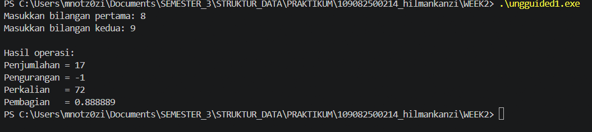
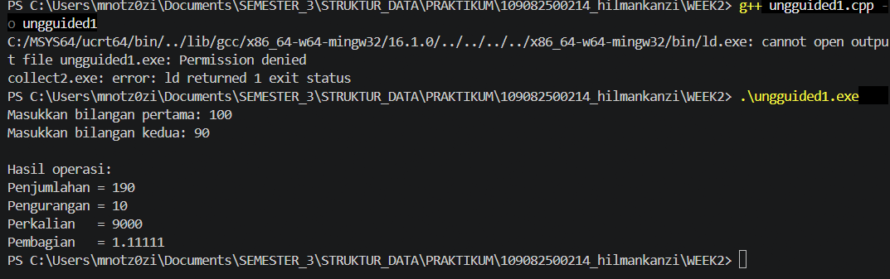
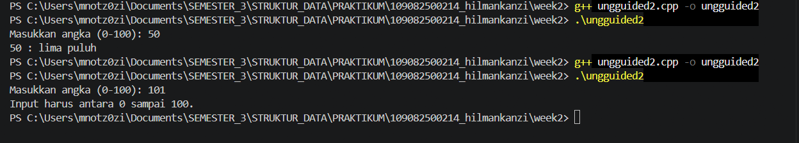
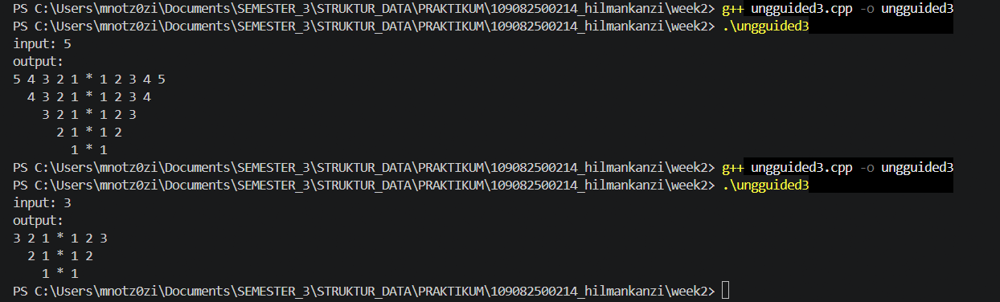

# <h1 align="center">Laporan Praktikum Modul 1 - Codeblocks IDE & Pengenalan Bahas C++ (Bagian Pertama)</h1>
<p align="center">Muhammad Dhimas Hafizh Fathurrahman - 2311102151</p>

## Dasar Teori
pemrograman c++ itu sangat mudah[1]

### A. ...<br/>
...
#### 1. ...
#### 2. ...
#### 3. ...

### B. ...<br/>
...
#### 1. ...
#### 2. ...
#### 3. ...


## Unguided 

### 1. unguided 1

```C++
#include <iostream>
using namespace std;

int main() {
    float a, b;

    cout << "Masukkan bilangan pertama: ";
    cin >> a;

    cout << "Masukkan bilangan kedua: ";
    cin >> b;

    cout << "\nHasil operasi:" << endl;
    cout << "Penjumlahan = " << a + b << endl;
    cout << "Pengurangan = " << a - b << endl;
    cout << "Perkalian   = " << a * b << endl;

    if (b != 0) {
        cout << "Pembagian   = " << a / b << endl;
    } else {
        cout << "Pembagian   = tidak dapat dilakukan (dibagi 0)" << endl;
    }

    return 0;
}
```
### Output Unguided 1 :

##### Output 1



##### Output 2


penjelasan unguided 1 

### 2. unguided 2

```C++
#include <iostream>
using namespace std;

string angka[] = {
    "nol", "satu", "dua", "tiga", "empat",
    "lima", "enam", "tujuh", "delapan", "sembilan",
    "sepuluh", "sebelas", "dua belas", "tiga belas",
    "empat belas", "lima belas", "enam belas",
    "tujuh belas", "delapan belas", "sembilan belas"
};

string terbilang(int n) {
    if (n < 20) {
        return angka[n];
    }
    else if (n < 100) {
        return angka[n / 10] + " puluh " + 
               (n % 10 == 0 ? "" : angka[n % 10]);
    }
    else {
        return "seratus";
    }
}

int main() {
    int n;

    cout << "Masukkan angka (0-100): ";
    cin >> n;

    if (n >= 0 && n <= 100) {
        cout << n << " : " << terbilang(n) << endl;
    } 
    else {
        cout << "Input harus antara 0 sampai 100." << endl;
    }

    return 0;
}
```
### Output Unguided 2 :

##### Output 1



penjelasan unguided 2

### 3. unguided 3

```C++
#include <iostream>
using namespace std;

int main() {
    int n;

    cout << "input: ";
    cin >> n;

    cout << "output:\n";

    for (int i = n; i >= 1; i--) {

        // Spasi di awal baris
        for (int s = n; s > i; s--) {
            cout << "  ";
        }

        // Angka menurun
        for (int j = i; j >= 1; j--) {
            cout << j << " ";
        }

        // Bintang
        cout << "*";

        // Angka menaik
        for (int j = 1; j <= i; j++) {
            cout << " " << j;
        }

        cout << endl;
    }

    return 0;
}
```
### Output Unguided 3 :

##### Output 1



penjelasan unguided 3

## Kesimpulan
...

## Referensi
[1] Triase. (2020). Diktat Edisi Revisi : STRUKTUR DATA. Medan: UNIVERSTAS ISLAM NEGERI SUMATERA UTARA MEDAN. 
<br>[2] Indahyati, Uce., Rahmawati Yunianita. (2020). "BUKU AJAR ALGORITMA DAN PEMROGRAMAN DALAM BAHASA C++". Sidoarjo: Umsida Press. Diakses pada 10 Maret 2024 melalui https://doi.org/10.21070/2020/978-623-6833-67-4.
<br>...
