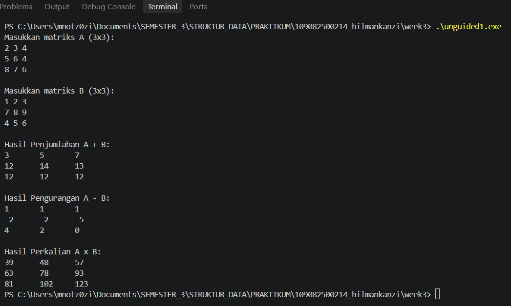
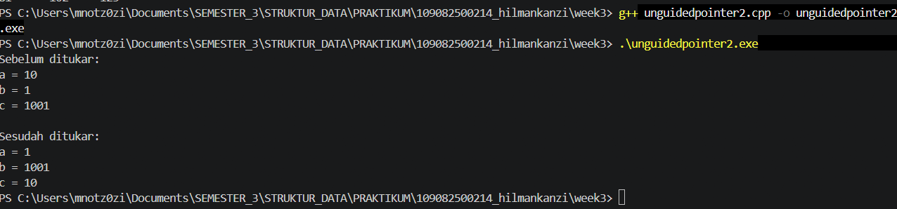
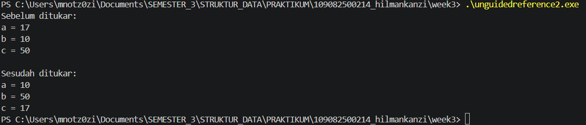
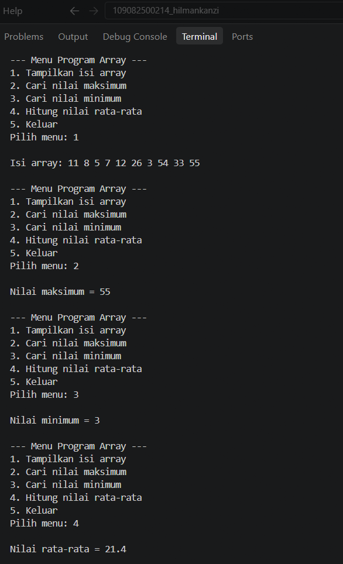

# <h1 align="center">Laporan Praktikum Modul 2 - Pengenalan Bahas C++ (Bagian Kedua)</h1>
<p align="center">Hilman Kanzi - 109082500214</p>

## Dasar Teori
Pengelolaan data merupakan salah satu aspek fundamental dalam pengembangan perangkat lunak modern untuk mengelola data secara efektif, efisien, dan terstruktur. Dalam bahasa pemrograman C++,[1] pengelolaan koleksi data berukuran statis maupun dinamis sering kali dikombinasikan dengan struktur data seperti array dan penunjuk alamat memori pointer untuk meningkatkan efisiensi pemrosesan.

## Guided 

### 1. ...

```C++
#include <iostream>
using namespace std;

int main() {
    int nilai[5];

    nilai[0] = 80;
    nilai[1] = 85;
    nilai[2] = 90;
    nilai[3] = 75;
    nilai[4] = 95;

    for (int i = 0; i < 5; i++) {
        cout << "index ke-" << i << " = " << nilai[i] << endl;
    }

    return 0;
}

```
Program menjalankan konsep dasar array, mulai dari deklarasi variabel array bernilai 5 elemen (int nilai[5]), pengisian data manual dari indeks 0 hingga 4, hingga pencetakan seluruh nilainya ke layar secara berurutan menggunakan perulangan for

### 2. ...

```C++
#include <iostream>
using namespace std;

int main() {
    int nilai[3][3] = {
        {80, 85, 90},
        {75, 80, 85},
        {90, 95, 100}
    };

    // for (int i = 0; i < 3; i++) {
    //     for (int j = 0; j < 3; j++) {
    //         cout << nilai[i][j] << " ";
    //     }
    //     cout << endl;
    // }

    cout << nilai[0][0] << endl; //80
    cout << nilai[1][1] << endl; //80
    cout << nilai[2][2] << " ";  //100

    return 0;
}
```
pProgram tersebut mempelajari materi array 2 dimensi dalam C++, yang mencakup deklarasi matriks ukuran $3 \times 3$, pengisian nilainya secara langsung, serta cara mengakses elemen spesifik menggunakan indeks baris dan kolom. Perulangan for bersarang disiapkan sebagai opsi untuk menampilkan seluruh isi matriks, tetapi bagian yang aktif hanya mencetak nilai diagonal utama pada indeks [0][0], [1][1], dan [2][2].

### 3. ...

```C++
#include <iostream>
using namespace std;

int main() {
    int data[2][3][3] = {
        {
            {1, 2, 3},
            {4, 5, 6},
            {7, 8, 9}
        },
        {
            {10, 11, 12},
            {13, 14, 15},
            {16, 17, 18}
        }
    };

    // for (int i = 0; i < 2; i++) {
    //     for (int j = 0; j < 3; j++) {
    //         for (int k = 0; k < 3; k++) {
    //             cout << data[i][j][k] << " ";
    //         }
    //         cout << endl;
    //     }
    //     cout << endl;
    // }

    cout << data[0][1][1] << " "; // 5

    return 0;
}
```
Program tersebut mempelajari materi array 3 dimensi dalam C++ yang menyimpan data bertingkat (lapisan, baris, dan kolom). Kode ini menyiapkan perulangan for tiga tingkat untuk menampilkan seluruh elemen, namun bagian yang aktif hanya mencetak satu nilai spesifik pada indeks data[0][1][1] yaitu angka 5.

### 4. ...

```C++
#include <iostream>
using namespace std;

int main() {
    int data[2][2][2][2] = {
        {
            {
                {1, 2},
                {3, 4}
            },
            {
                {5, 6},
                {7, 8}
            }
        },
        {
            {
                {9, 10},
                {11, 12}
            },
            {
                {13, 14},
                {15, 16}
            }
        }
    };

    cout << data[0][0][0][0] << endl; // 1
    cout << data[1][1][1][1] << endl; // 16

    return 0;
}
```
Program tersebut mempelajari array 4 dimensi berukuran $2 \times 2 \times 2 \times 2$ dalam C++. Kode ini mendemonstrasikan cara mengakses elemen pertama (data[0][0][0][0] = 1) dan elemen terakhir (data[1][1][1][1] = 16) menggunakan 4 indeks.

### 5. ...

```C++
#include <iostream>
using namespace std;

int main() {
    char a;
    int j;
    char arr[6];

    arr[3] = 'b';
    a = 'u';
    j = 10;

    cout << a << endl;      // u
    cout << &a << endl;     // alamat memory atau address

    cout << j << endl;      // 10
    cout << &j << endl;     // alamat memory atau address

    cout << arr[3] << endl;     // value
    cout << &(arr[4]) << endl;  // alamat memory atau address

    return 0;
}
```
Program tersebut mempelajari konsep variabel,array karakter (char),dan alamat memori (pointer/address) menggunakan operator & di C++. Kode ini mendemonstrasikan cara menampilkan nilai variabel (u, 10,'b') sekaligus melihat letak alamat memori dari variabel dan elemen array tersebut di dalam komputer.

### 6. ...

```C++
#include <iostream>
using namespace std;

int main() {
    int x, y;
    int *px;

    x = 87;
    px = &x;
    y = *px;

    cout << "Alamat x= " << &x << endl;
    cout << "Isi px= " << px << endl;
    cout << "Isi x= " << x << endl;
    cout << "Nilai yang ditunjuk px= " << *px << endl;
    cout << "Nilai y= " << y << endl;

    return 0;
}
```
Program tersebut mempelajari konsep dasar pointer dalam C++. Kode ini mendemonstrasikan cara menyimpan alamat memori variabel x ke dalam pointer px (px = &x), mengambil nilai melalui pointer menggunakan dereference (*px), serta menyalin nilai tersebut ke variabel y.

### 7. ...

```C++
#include <iostream>
#define MAX 5
using namespace std;

int main() {
    int i, j;
    float nilai_total, rata_rata;
    float nilai[MAX];

    static int nilai_tahun[MAX][MAX] = {
        {0, 2, 2, 0, 0},
        {0, 1, 1, 0, 0},
        {0, 3, 3, 3, 0},
        {4, 4, 0, 0, 4},
        {5, 0, 0, 0, 5}
    };

    // inisialisasi array satu dimensi
    for (i = 0; i < MAX; i++) {
        cout << "masukkan nilai ke-" << i + 1 << endl;
        cin >> nilai[i];
    }

    cout << "\ndata nilai siswa :\n";

    // menampilkan array satu dimensi
    for (i = 0; i < MAX; i++) {
        cout << "nilai ke-" << i + 1 << " = " << nilai[i] << endl;
    }

    cout << "\n nilai tahunan : \n";

    // menampilkan array dua dimensi
    for (i = 0; i < MAX; i++) {
        for (j = 0; j < MAX; j++) {
            cout << nilai_tahun[i][j];
        }

        cout << "\n";
    }

    return 0;
}
```
Program tersebut mempelajari kombinasi penggunaan array 1 dimensi dan array 2 dimensi dalam C++. Kode ini mendemonstrasikan cara menerima input nilai siswa lalu menampilkannya via array 1D (nilai[MAX]), sekaligus mencetak matriks data $5 \times 5$ menggunakan array 2D (nilai_tahun[MAX][MAX]).

### 8. ...

```C++
#include <iostream>
using namespace std;

int main() {
    char nama[] = "strukdat";

    cout << nama << endl;
    cout << nama[3] << endl;

    return 0;
}
```
Program tersebut mempelajari array dari karakter (char) sebagai string dalam C++. Kode ini mendemonstrasikan cara menampilkan keseluruhan isi teks ("strukdat") sekaligus mengakses karakter tertentu berdasarkan indeksnya (nama[3], yaitu huruf 'u').

## Unguided 

### 1. (Buatlah program yang dapat melakukan operasi penjumlahan, pengurangan, dan perkalian matriks 3x3 )
```C++
#include <iostream>
using namespace std;

int main() {
    int A[3][3], B[3][3];
    int jumlah[3][3], kurang[3][3], kali[3][3];

    cout << "Masukkan matriks A (3x3):" << endl;
    for (int i = 0; i < 3; i++) {
        for (int j = 0; j < 3; j++) {
            cin >> A[i][j];
        }
    }

    cout << "\nMasukkan matriks B (3x3):" << endl;
    for (int i = 0; i < 3; i++) {
        for (int j = 0; j < 3; j++) {
            cin >> B[i][j];
        }
    }

    // Penjumlahan dan pengurangan
    for (int i = 0; i < 3; i++) {
        for (int j = 0; j < 3; j++) {
            jumlah[i][j] = A[i][j] + B[i][j];
            kurang[i][j] = A[i][j] - B[i][j];
        }
    }

    // Perkalian matriks
    for (int i = 0; i < 3; i++) {
        for (int j = 0; j < 3; j++) {
            kali[i][j] = 0;

            for (int k = 0; k < 3; k++) {
                kali[i][j] += A[i][k] * B[k][j];
            }
        }
    }

    cout << "\nHasil Penjumlahan A + B:" << endl;
    for (int i = 0; i < 3; i++) {
        for (int j = 0; j < 3; j++) {
            cout << jumlah[i][j] << "\t";
        }
        cout << endl;
    }

    cout << "\nHasil Pengurangan A - B:" << endl;
    for (int i = 0; i < 3; i++) {
        for (int j = 0; j < 3; j++) {
            cout << kurang[i][j] << "\t";
        }
        cout << endl;
    }

    cout << "\nHasil Perkalian A x B:" << endl;
    for (int i = 0; i < 3; i++) {
        for (int j = 0; j < 3; j++) {
            cout << kali[i][j] << "\t";
        }
        cout << endl;
    }

    return 0;
}
```
### Output Unguided 1 :

##### Output 1


penjelasan unguided 1 
Program unguided 1 mengolah dua matriks 3x3 menggunakan array 2D untuk melakukan penjumlahan, pengurangan, dan perkalian elemen. Penjumlahan dan pengurangan dihitung pada indeks yang sama, sedangkan perkalian menggunakan perulangan bersarang tiga tingkat.

### 2. (Berdasarkan guided pointer dan reference sebelumnya, buatlah keduanya dapat menukar nilai dari 3 variabel )
Pointer
```C++
#include <iostream>
using namespace std;

void tukarPointer(int *a, int *b, int *c) {
    int temp = *a;

    *a = *b;
    *b = *c;
    *c = temp;
}

int main() {
    int a = 10;
    int b = 01;
    int c = 1001;

    cout << "Sebelum ditukar:" << endl;
    cout << "a = " << a << endl;
    cout << "b = " << b << endl;
    cout << "c = " << c << endl;

    tukarPointer(&a, &b, &c);

    cout << "\nSesudah ditukar:" << endl;
    cout << "a = " << a << endl;
    cout << "b = " << b << endl;
    cout << "c = " << c << endl;

    return 0;
}
```
Reference
```C++
#include <iostream>
using namespace std;

void tukarReference(int &a, int &b, int &c) {
    int temp = a;

    a = b;
    b = c;
    c = temp;
}

int main() {
    int a = 17;
    int b = 10;
    int c = 50;

    cout << "Sebelum ditukar:" << endl;
    cout << "a = " << a << endl;
    cout << "b = " << b << endl;
    cout << "c = " << c << endl;

    tukarReference(a, b, c);

    cout << "\nSesudah ditukar:" << endl;
    cout << "a = " << a << endl;
    cout << "b = " << b << endl;
    cout << "c = " << c << endl;

    return 0;
}
```
### Output Unguided 2 :

##### Output 1


##### Output 2


penjelasan unguided 2
Program pertama menukar nilai tiga variabel menggunakan pointer tukarPointer yang menerima alamat memori variabel dengan operator & dan mengabstraksi lokasinya via dereference. Program kedua menggunakan reference tukarReference yang langsung mengakses alias dari variabel asli tanpa penanda alamat khusus saat pemanggilan fungsi. Kedua program tersebut memanfaatkan variabel bantuan temp untuk menggeser nilai variabel a ke b, b ke c, dan c ke a.

### 3. (Diketahui sebuah array 1 dimensi sebagai berikut :  arrA = {11, 8, 5, 7, 12, 26, 3, 54, 33, 55} Buatlah program yang dapat mencari nilai minimum, maksimum, dan rata – rata dari array tersebut! Gunakan function cariMinimum() untuk mencari nilai minimum dan function cariMaksimum() untuk mencari nilai maksimum, serta gunakan prosedur hitungRataRata() untuk menghitung nilai rata – rata! Buat program menggunakan menu switch-case seperti berikut ini : --- Menu Program Array --- 1. Tampilkan isi array 2. cari nilai maksimum 3. cari nilai minimum 4. Hitung nilai rata - rata )

```C++
#include <iostream>
using namespace std;

int cariMinimum(int arr[], int n) {
    int minimum = arr[0];

    for (int i = 1; i < n; i++) {
        if (arr[i] < minimum) {
            minimum = arr[i];
        }
    }

    return minimum;
}

int cariMaksimum(int arr[], int n) {
    int maksimum = arr[0];

    for (int i = 1; i < n; i++) {
        if (arr[i] > maksimum) {
            maksimum = arr[i];
        }
    }

    return maksimum;
}

float hitungRataRata(int arr[], int n) {
    int total = 0;

    for (int i = 0; i < n; i++) {
        total += arr[i];
    }

    return (float) total / n;
}

int main() {
    int arrA[] = {11, 8, 5, 7, 12, 26, 3, 54, 33, 55};
    int n = 10;
    int pilihan;

    do {
        cout << "\n--- Menu Program Array ---" << endl;
        cout << "1. Tampilkan isi array" << endl;
        cout << "2. Cari nilai maksimum" << endl;
        cout << "3. Cari nilai minimum" << endl;
        cout << "4. Hitung nilai rata-rata" << endl;
        cout << "5. Keluar" << endl;
        cout << "Pilih menu: ";
        cin >> pilihan;

        switch (pilihan) {
            case 1:
                cout << "\nIsi array: ";
                for (int i = 0; i < n; i++) {
                    cout << arrA[i] << " ";
                }
                cout << endl;
                break;

            case 2:
                cout << "\nNilai maksimum = "
                     << cariMaksimum(arrA, n) << endl;
                break;

            case 3:
                cout << "\nNilai minimum = "
                     << cariMinimum(arrA, n) << endl;
                break;

            case 4:
                cout << "\nNilai rata-rata = "
                     << hitungRataRata(arrA, n) << endl;
                break;

            case 5:
                cout << "\nProgram selesai." << endl;
                break;

            default:
                cout << "\nPilihan tidak tersedia." << endl;
        }

    } while (pilihan != 5);

    return 0;
}
```
### Output Unguided 3 :

##### Output 1


penjelasan unguided 3
Program tersebut mendemonstrasikan pengolahan array 1 dimensi menggunakan menu interaktif do-while dan switch-case. Program ini memanfaatkan fungsi terpisah untuk menampilkan data, mencari nilai maksimum dan minimum melalui penelusuran elemen, serta menghitung nilai rata-rata dari seluruh data array.

## Kesimpulan
Praktikum Modul 2 ini memberikan pemahaman mendalam mengenai pengolahan struktur data array multidimensi 1D hingga 4D,manajemen memori menggunakan pointer dan reference, serta penerapan modularisasi kode dalam bahasa C++. Melalui tugas unguided yang dikerjakan, mahasiswa mampu mengimplementasikan array 2 dimensi untuk merepresentasikan dan mengoperasikan aritmetika matriks 3x3, memanfaatkan mekanisme pass-by-reference melalui pointer maupun reference untuk menukar nilai tiga variabel, serta membangun program pengolahan array 1 dimensi yang dinamis dan terstruktur menggunakan kombinasi fungsi terpisah, perulangan do-while, dan kontrol menu switch-case.
...

## Referensi
[1] Y. R. Santoso dan A. F. Gavriel, "Implementasi Pengelolaan Data Mahasiswa Menggunakan Pointer dan Sorting Berbasis Bahasa C++," Jatekom (Jurnal Aplikasi Teknologi dan Komputasi), vol. 1, no. 4, hlm. 1–7, 2025.https://journals.arces.org/jatekom/article/view/124